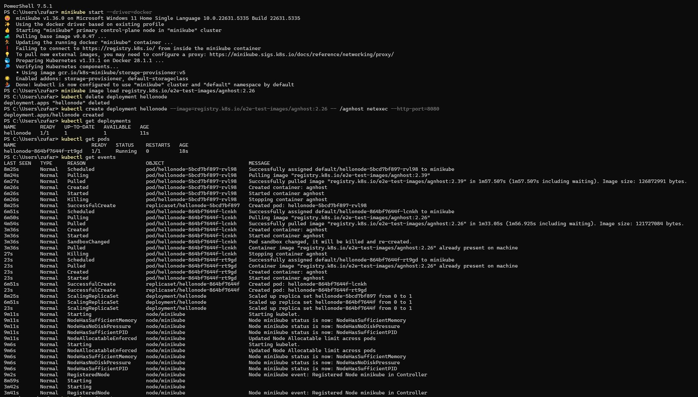
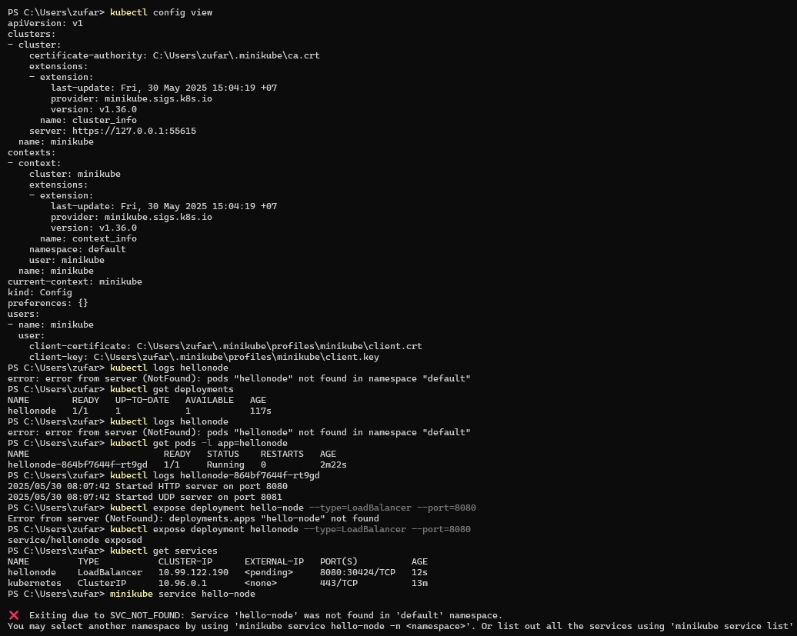
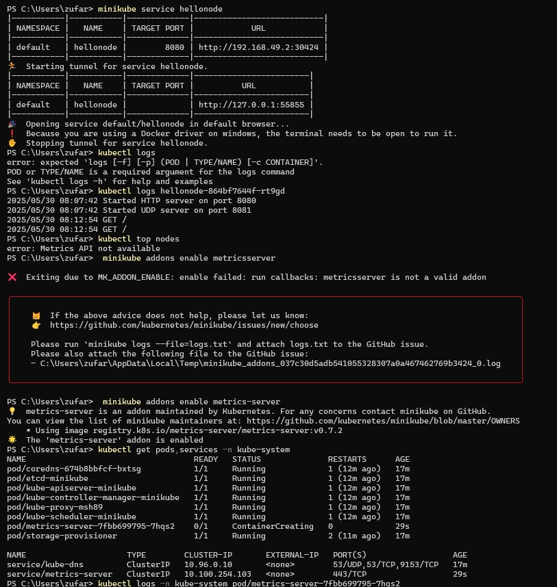
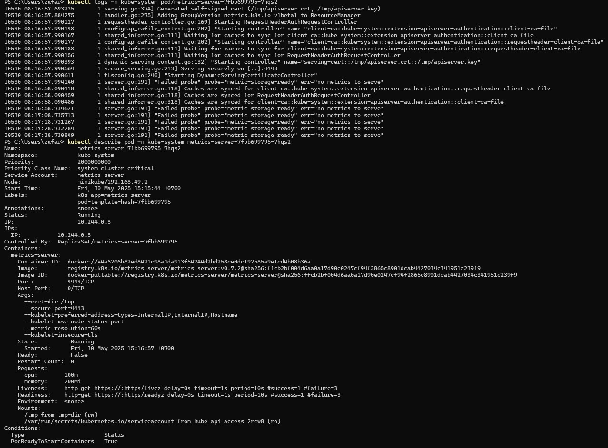
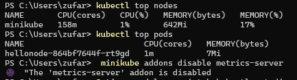

# Reflection Tutorial Modul 11

**Zufar Romli Amri**  
**NPM**: 2306202694  
**Kelas**: A

---

### Reflection on Hello Minikube

## 1. Compare the application logs before and after you exposed it as a Service.Try to open the app several times while the proxy into the Service is running. What do you see in the logs? Does the number of logs increase each time you open the app?

Sebelum aplikasi di-expose sebagai Service, log aplikasi hanya menunjukkan bahwa HTTP server telah dimulai pada port 8080 dan UDP server pada port 8081. Pada tahap ini, aplikasi berjalan di dalam Pod tetapi tidak dapat diakses dari luar cluster. Setelah aplikasi di-expose menggunakan kubectl expose dan diakses melalui minikube service hellonode, log aplikasi akan menampilkan aktivitas tambahan setiap kali aplikasi dibuka melalui browser. Setiap permintaan HTTP yang masuk ke aplikasi akan tercatat dalam log, sehingga jumlah entri log akan bertambah setiap kali saya membuka atau me-refresh aplikasi di browser. Hal ini menunjukkan bahwa Service berhasil meneruskan traffic dari luar cluster ke Pod yang menjalankan aplikasi, dan setiap interaksi pengguna dengan aplikasi akan terekam dalam log container.

---

### 2. Notice that there are two versions of `kubectl get` invocation during this tutorial section. The first does not have any option, while the latter has `-n` option with value set to `kube-system`.What is the purpose of the `-n` option and why did the output not list the pods/services that you explicitly created?

Option -n dalam perintah kubectl get digunakan untuk menentukan namespace tertentu yang ingin dilihat resource-nya. Kubernetes menggunakan konsep namespace untuk memisahkan dan mengorganisir resource dalam sebuah cluster. Ketika menjalankan kubectl get pods atau kubectl get deployments tanpa option -n, kubectl akan menampilkan resource dari namespace "default" yang merupakan namespace bawaan untuk resource yang dibuat pengguna. Sedangkan ketika menggunakan kubectl get pods,services -n kube-system, perintah ini akan menampilkan resource dari namespace "kube-system" yang berisi komponen sistem Kubernetes seperti coredns, etcd, kube-apiserver, dan lain-lain. Namespace "kube-system" khusus digunakan untuk resource yang dikelola oleh sistem Kubernetes itu sendiri, bukan untuk aplikasi pengguna. Oleh karena itu, Pod dan Service yang saya buat secara eksplisit (seperti hellonode) tidak muncul dalam output kubectl get dengan option -n kube-system karena resource tersebut berada di namespace "default", bukan di namespace "kube-system".

---

### Reflection on Rolling Update & Kubernetes Manifest File

## 1. What is the difference between Rolling Update and Recreate deployment strategy?

Rolling Update dan Recreate merupakan dua strategi deployment yang berbeda dalam Kubernetes. Rolling Update adalah strategi default yang melakukan pembaruan aplikasi secara bertahap tanpa menyebabkan downtime. Dalam strategi ini, pod-pod lama akan digantikan secara perlahan dengan pod-pod baru yang menjalankan versi aplikasi terbaru. Proses ini berlangsung secara incremental, dimana beberapa pod lama masih berjalan sementara pod baru mulai dibuat, sehingga aplikasi tetap dapat melayani request selama proses update berlangsung. Sebaliknya, strategi Recreate akan menghentikan semua pod yang sedang berjalan terlebih dahulu, kemudian baru membuat pod-pod baru dengan versi terbaru. Hal ini menyebabkan aplikasi mengalami downtime selama proses deployment karena tidak ada pod yang melayani request dalam periode tertentu.

---

### 2. Try deploying the Spring Petclinic REST using Recreate deployment strategy and document your attempt.

Untuk menerapkan strategi Recreate, perlu dilakukan modifikasi pada konfigurasi deployment yang sudah ada. Berdasarkan file deployment.yaml yang telah dibuat, dapat dilihat bahwa saat ini menggunakan strategi RollingUpdate dengan pengaturan maxSurge dan maxUnavailable masing-masing 25%. Untuk mengubahnya menjadi Recreate, bagian strategy dalam deployment manifest perlu dimodifikasi menjadi type: Recreate dan menghapus konfigurasi rollingUpdate. Setelah melakukan perubahan ini, deployment akan menghentikan semua pod yang sedang berjalan terlebih dahulu sebelum membuat pod-pod baru, yang dapat diamati melalui command kubectl get pods dan kubectl rollout status.

---

### 3.Prepare different manifest files for executing Recreate deployment strategy.

Untuk membuat manifest file yang menggunakan strategi Recreate, perlu memodifikasi bagian spec.strategy dalam deployment.yaml. Pengaturan yang sebelumnya menggunakan type: RollingUpdate dengan konfigurasi maxSurge dan maxUnavailable harus diubah menjadi type: Recreate saja. File service.yaml tidak perlu diubah karena konfigurasi service tidak bergantung pada strategi deployment yang digunakan. Manifest file untuk Recreate strategy akan memiliki struktur yang lebih sederhana dalam bagian strategy karena tidak memerlukan pengaturan tambahan seperti maxSurge dan maxUnavailable yang diperlukan pada Rolling Update.

---

### 4. What do you think are the benefits of using Kubernetes manifest files? Recall your experience in deploying the app manually and compare it to your experience when deploying the same app by applying the manifest files (i.e., invoking `kubectl apply-f` command) to the cluster.

Penggunaan Kubernetes manifest files memberikan berbagai keuntungan signifikan dibandingkan dengan deployment manual menggunakan command kubectl secara langsung. Pertama, manifest files menyediakan reproducibility yang tinggi, dimana konfigurasi deployment dapat dijalankan berulang kali dengan hasil yang konsisten. Kedua, manifest files memungkinkan version control, sehingga setiap perubahan konfigurasi dapat dilacak dan di-rollback jika diperlukan. Ketiga, proses deployment menjadi lebih efisien karena seluruh konfigurasi dapat diaplikasikan sekaligus dengan satu command kubectl apply -f dibandingkan harus menjalankan multiple commands secara manual. Keempat, manifest files memfasilitasi kolaborasi tim yang lebih baik karena konfigurasi deployment dapat dibagikan dan dikelola bersama melalui sistem version control seperti Git. Kelima, manifest files mendukung Infrastructure as Code (IaC) practices yang memungkinkan pengelolaan infrastruktur dengan pendekatan yang sama seperti pengelolaan source code. Terakhir, manifest files memudahkan dokumentasi dan pemeliharaan konfigurasi deployment dalam jangka panjang.